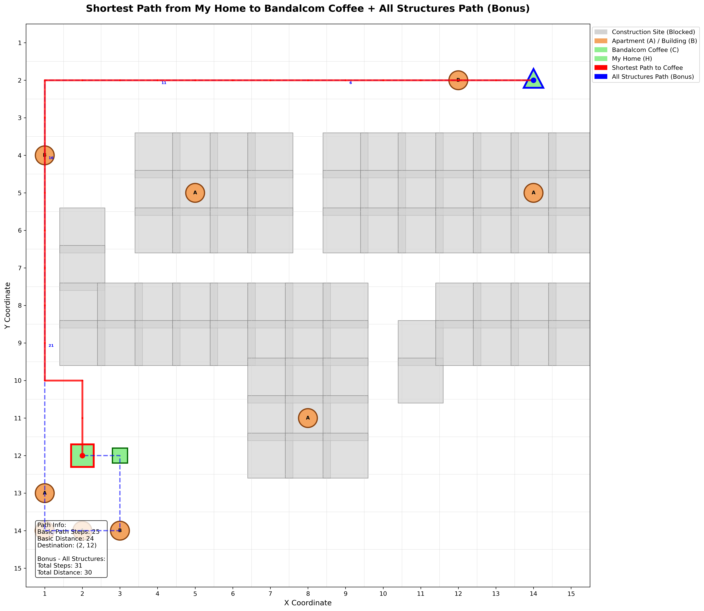
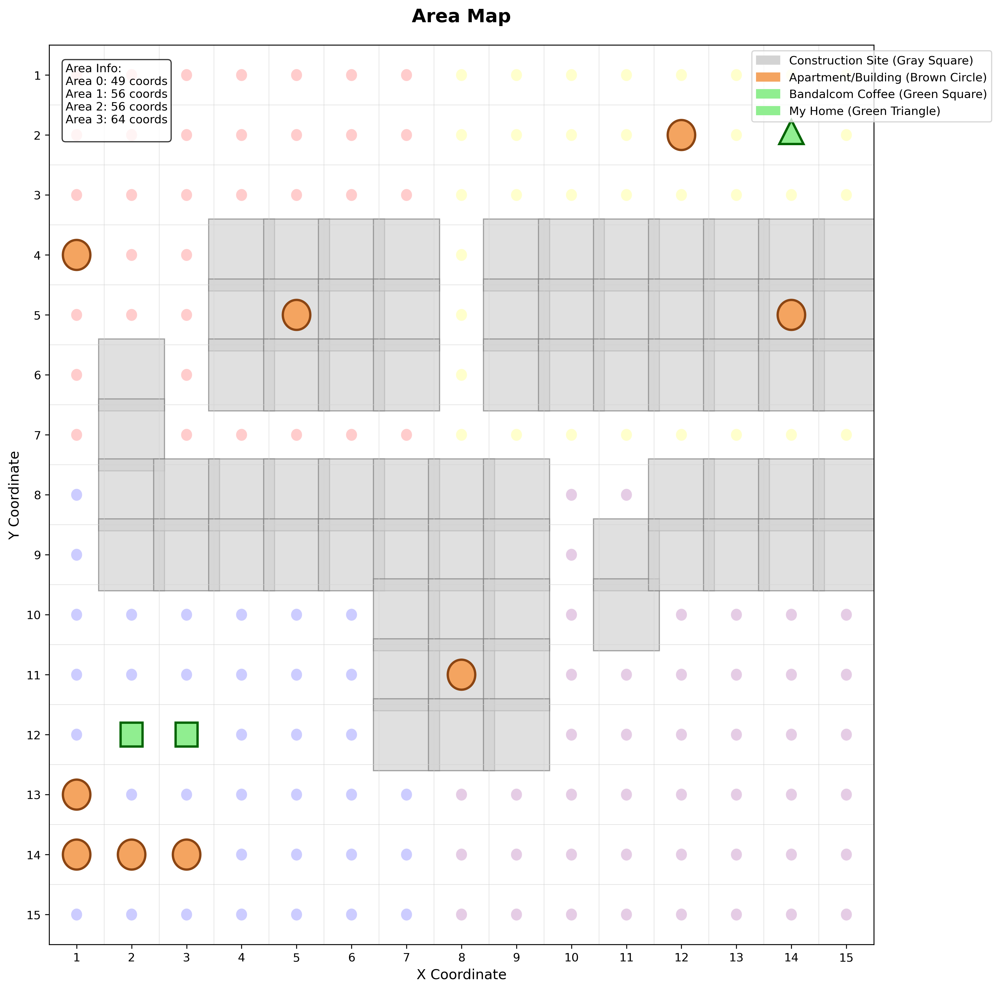

# 🍵 반달곰 커피 최단경로 탐색 프로젝트


**내 집에서 반달곰 커피까지의 최단 경로를 찾는 BFS 알고리즘 구현 프로젝트**


*▲ 완성된 최단경로 지도: 빨간선(집→커피), 파란점선(모든 구조물 방문)*

## 📑 목차

- [프로젝트 개요](#프로젝트-개요)
- [프로젝트 구성](#프로젝트-구성)
- [설치 및 실행](#설치-및-실행)
- [단계별 상세 설명](#단계별-상세-설명)
- [결과 파일](#결과-파일)
- [알고리즘 설명](#알고리즘-설명)
- [Q&A](#qa)
- [기술적 제약사항](#기술적-제약사항)
- [파일 구조](#파일-구조)

## 🎯 프로젝트 개요

이 프로젝트는 CSV 데이터를 기반으로 지역 지도를 시각화하고, BFS(Breadth-First Search) 알고리즘을 사용하여 내 집에서 반달곰 커피까지의 최단 경로를 찾는 프로그램입니다.

### 🌟 주요 기능

- **데이터 분석**: 3개 CSV 파일 병합 및 Area 1 지역 필터링
- **지도 시각화**: 15×15 그리드 맵에 구조물과 건설현장 표시
- **최단 경로 탐색**: BFS 알고리즘으로 집→커피숍 최단경로 계산
- **보너스 기능**: 모든 구조물을 방문하는 최적화된 경로 (Greedy TSP)

### 📊 데이터 구조

| 파일 | 크기 | 역할 |
|------|------|------|
| `area_category.csv` | 4행×2열 | 구조물 코드↔이름 매핑 |
| `area_map.csv` | 225행×3열 | 좌표별 건설현장 정보 |
| `area_struct.csv` | 225행×4열 | 좌표별 구조물 배치 |

## 📘 프로젝트 구성

### 📂 1단계: 데이터 수집 및 분석
**파일**: `caffee_map.py`

#### ✔ 수행 내용
1. **CSV 파일 로딩**: area_map.csv, area_struct.csv, area_category.csv 불러오기
2. **데이터 검증**: 각 파일별 결측치 확인 및 처리
3. **구조물 매핑**: ID(1,2,3,4) → 이름(Apartment, Building, MyHome, BandalgomCoffee) 변환
4. **데이터 병합**: 좌표(x,y)를 기준으로 INNER JOIN
5. **Area 필터링**: 반달곰 커피가 집중된 Area 1 데이터만 추출
6. **통계 분석**: 구조물 종류별 분포 및 건설현장 비율 계산

#### 📊 결과
- `area1_coffee_data.csv`: Area 1의 56개 지점 데이터
- 구조물 종류별 요약 통계 리포트

#### 🔍 핵심 기술
```python
# 구조물 ID → 이름 변환
category_mapping = dict(zip(area_category['category'], area_category['struct']))
area_struct['struct_name'] = area_struct['category'].map(category_mapping)
area_struct['struct_name'] = area_struct['struct_name'].fillna('Empty')

# 데이터 병합 (x,y 좌표 기준)
merged_data = pd.merge(area_map, area_struct, on=['x', 'y'], how='inner')
```

### 🗺 2단계: 지도 시각화
**파일**: `map_draw.py`

#### ✔ 수행 내용
1. **좌표계 설정**: 좌측 상단 (1,1), 우측 하단 (15,15)
2. **그리드 생성**: 가로/세로 그리드 라인 표시
3. **구조물 시각화**:
   - 아파트/빌딩: 갈색 원형 ⭕
   - 반달곰 커피: 녹색 사각형 🟩
   - 내 집: 녹색 삼각형 🔺
   - 건설현장: 회색 사각형 ⬜
4. **범례 추가**: 각 구조물별 색상 및 모양 설명
5. **Area 구분**: 4개 구역(0,1,2,3) 경계 표시

#### 📊 결과
- `map.png`: 15×15 그리드 지도 이미지


*▲ 2단계 결과: 구조물별 색상과 모양으로 구분된 기본 지도*

#### 🔍 핵심 기술
```python
# Y축 뒤집기 (좌측 상단이 (1,1)이 되도록)
ax.invert_yaxis()

# 구조물별 다른 모양으로 시각화
if struct_type == 'Apartment':
    circle = patches.Circle((x, y), 0.25, facecolor='sandybrown')
elif struct_type == 'MyHome':
    triangle = patches.Polygon([(x, y-0.3), (x-0.26, y+0.2), (x+0.26, y+0.2)])
```

### 🚶 3단계: 최단 경로 탐색
**파일**: `map_direct_save.py`

#### ✔ 수행 내용
1. **그리드 맵 생성**: 순수 Python 2D 리스트로 15×15 격자 생성
2. **장애물 설정**: 건설현장(ConstructionSite=1)을 이동불가 지역으로 설정
3. **BFS 경로 탐색**: 
   - 시작점: 내 집 (14,2)
   - 목표점: 반달곰 커피 (2,12), (3,12)
   - 4방향 이동만 허용 (상하좌우)
4. **경로 저장**: CSV 형태로 단계별 좌표 저장
5. **시각화**: 빨간 선으로 최단경로 표시
6. **보너스**: 모든 구조물 방문 경로 (파란 점선)

#### 📊 결과
- `home_to_cafe.csv`: 기본 최단경로 (25단계, 거리 24)
- `home_to_all_structures.csv`: 모든 구조물 방문 경로 (31단계, 거리 30)
- `map_final.png`: 경로가 표시된 최종 지도


*▲ 3단계 최종 결과: 빨간선(최단경로), 파란점선(모든 구조물 방문), 구조물 라벨링*

#### 🔍 핵심 기술
```python
# BFS 알고리즘 (순수 Python)
queue = [(start_x, start_y, 0, [start_grid])]
visited = set()
directions = [(-1,0), (1,0), (0,-1), (0,1)]  # 상하좌우

while queue:
    x, y, distance, path = queue.pop(0)
    if (x, y) in dest_grids:
        return path, distance
    
    for dx, dy in directions:
        nx, ny = x + dx, y + dy
        if 0 <= nx < width and 0 <= ny < height:
            if (nx, ny) not in visited and grid[ny][nx] == 0:
                visited.add((nx, ny))
                queue.append((nx, ny, distance + 1, path + [(nx, ny)]))
```

## 🚀 설치 및 실행

### 📋 필수 요구사항
```bash
Python 3.8+
pandas
matplotlib
```

### 📦 설치 방법
```bash
# 필요한 라이브러리 설치
pip install pandas matplotlib

# 프로젝트 클론
git clone <repository-url>
cd bandalcom-coffee-pathfinding
```

### ▶️ 실행 방법

#### 순차 실행 (권장)
```bash
# 1단계: 데이터 분석
python caffee_map.py

# 2단계: 지도 시각화  
python map_draw.py

# 3단계: 최단 경로 탐색
python map_direct_save.py
```

#### 한번에 최종 결과 보기
```bash
# 3단계만 실행해도 모든 기능 체험 가능
python map_direct_save.py
```

### 📁 생성되는 결과 파일
- `area1_coffee_data.csv` - 1단계 결과
- `map.png` - 2단계 결과
- `home_to_cafe.csv` - 3단계 기본 경로
- `home_to_all_structures.csv` - 3단계 보너스 경로
- `map_final.png` - 3단계 최종 지도

## 🧠 알고리즘 설명

### 🔍 BFS (Breadth-First Search) 최단경로 알고리즘

#### 알고리즘 선택 이유
- **최단경로 보장**: 가중치가 없는 그래프에서 최단경로를 보장
- **단순성**: 구현이 직관적이고 이해하기 쉬움
- **메모리 효율**: 다익스트라 대비 간단한 자료구조 사용

#### 동작 과정
1. **초기화**: 시작점을 큐에 추가, 방문 체크
2. **탐색**: 큐에서 현재 위치 꺼내기
3. **목표 확인**: 목표지점 도달시 경로 반환
4. **확장**: 4방향으로 이동 가능한 지점을 큐에 추가
5. **반복**: 큐가 빌 때까지 2-4 과정 반복

#### 시간 복잡도
- **시간**: O(V + E) = O(225 + 900) = O(1125)
- **공간**: O(V) = O(225)

### 🎯 보너스: Greedy TSP 알고리즘

모든 구조물을 방문하는 문제는 TSP(Traveling Salesman Problem)의 변형입니다.

#### 동작 과정
1. **현재 위치**에서 시작
2. **미방문 구조물** 중 가장 가까운 곳 선택
3. **BFS로 경로 계산**하여 이동
4. **모든 구조물 방문**까지 반복

#### 성능
- 9개 구조물을 30단계로 모두 방문
- 완전탐색 대비 빠른 근사해 제공

## 🔧 기술적 제약사항

### 📝 PEP 8 준수
- **함수명**: snake_case (예: `load_and_prepare_data`)
- **변수명**: snake_case, 예약어 충돌 방지
- **문자열**: 기본 작은따옴표(`'`) 사용
- **들여쓰기**: 공백 4칸
- **대입문**: `=` 앞뒤 공백

### 📚 라이브러리 제한
- **CSV 처리**: pandas만 허용
- **시각화**: matplotlib만 허용  
- **알고리즘**: 순수 Python (numpy, collections 금지)

### 🎯 구현 방식
- **그리드**: 순수 Python 2D 리스트
- **큐**: `list.pop(0)` 사용 (collections.deque 대신)
- **집합**: Python 내장 `set()` 사용

## 📂 파일 구조

```
bandalcom-coffee-pathfinding/
├── 📊 데이터 파일
│   ├── area_category.csv      # 구조물 코드 매핑 테이블
│   ├── area_map.csv          # 지역별 건설현장 정보  
│   └── area_struct.csv       # 좌표별 구조물 배치
│
├── 🐍 실행 파일  
│   ├── caffee_map.py         # 1단계: 데이터 분석
│   ├── map_draw.py           # 2단계: 지도 시각화
│   └── map_direct_save.py    # 3단계: 경로 탐색
│
├── 📋 결과 파일
│   ├── area1_coffee_data.csv # 1단계 결과
│   ├── map.png               # 2단계 결과  
│   ├── home_to_cafe.csv      # 3단계 기본 경로
│   ├── home_to_all_structures.csv # 3단계 보너스 경로
│   └── map_final.png         # 3단계 최종 지도
│
└── 📖 문서
    └── README.md             # 프로젝트 문서
```

## ❓ Q&A

### 🔍 데이터 관련

**Q: CSV 파일들은 어떻게 연결되나요?**
A: `area_map.csv`와 `area_struct.csv`를 (x,y) 좌표로 INNER JOIN하고, `area_category.csv`를 구조물 ID→이름 변환용 딕셔너리로 사용합니다.

**Q: Area 0,1,2,3은 무엇인가요?**
A: 15×15 맵을 4개 구역으로 나눈 것입니다:
- Area 0: (1~7, 1~7) - 왼쪽 상단
- Area 1: (1~7, 8~15) - 왼쪽 하단 (반달곰 커피 위치)
- Area 2: (8~15, 1~7) - 오른쪽 상단 (내 집 위치)  
- Area 3: (8~15, 8~15) - 오른쪽 하단

**Q: 건설현장은 어떻게 식별하나요?**
A: `area_map.csv`의 `ConstructionSite` 컬럼에서 1=건설현장(이동불가), 0=일반지역(이동가능)으로 구분합니다.

### 🗺️ 시각화 관련

**Q: 왜 Y축이 뒤집혀 있나요?**
A: 요구사항에 따라 좌측 상단이 (1,1)이 되도록 `ax.invert_yaxis()`를 사용했습니다.

**Q: 각 구조물의 색상 의미는?**
A: 
- 🟤 갈색 원: 아파트/빌딩
- 🟢 녹색 사각형: 반달곰 커피
- 🟢 녹색 삼각형: 내 집
- ⬜ 회색 사각형: 건설현장 (이동불가)

**Q: 파란색 점선은 무엇인가요?**
A: 보너스 기능으로 모든 구조물(아파트, 빌딩, 커피숍)을 한 번씩 방문하는 최적화된 경로입니다.

### 🧠 알고리즘 관련

**Q: 왜 BFS를 선택했나요?**
A: 
- 가중치가 없는 그리드에서 최단경로 보장
- 구현이 직관적이고 이해하기 쉬움
- 시간복잡도 O(V+E)로 효율적

**Q: 대각선 이동은 왜 제외했나요?**
A: 요구사항에서 명시하지 않았고, 일반적으로 격자 맵에서는 상하좌우 4방향 이동만 허용하는 것이 자연스럽습니다.

**Q: 여러 커피숍이 있는데 어떻게 선택하나요?**
A: BFS 특성상 먼저 도달한 커피숍을 선택합니다. (2,12)와 (3,12) 중 (2,12)가 더 가까워서 선택됩니다.

### 🔧 기술적 질문

**Q: numpy를 왜 사용하지 않았나요?**
A: 제약사항에서 "Python 기본 제공 명령어 이외의 라이브러리 금지"라고 했고, pandas(CSV용)과 matplotlib(시각화용)만 허용되어 순수 Python 리스트를 사용했습니다.

**Q: collections.deque 대신 list.pop(0)을 사용한 이유는?**
A: 마찬가지로 제약사항 때문입니다. deque가 더 효율적이지만, 순수 Python만 사용해야 해서 리스트의 pop(0)을 사용했습니다.

**Q: 결측치는 어떻게 처리했나요?**
A: 
- 파일 로딩 후 각 컬럼별 결측치 확인
- 좌표 정보 결측시 해당 행 제거
- 구조물 매핑 실패시 'Empty'로 대체
- 병합 후 최종 결측치 제거

### 🚀 성능 관련

**Q: 실행 시간은 얼마나 걸리나요?**
A: 
- 1단계 (데이터 분석): ~1초
- 2단계 (지도 시각화): ~2초  
- 3단계 (경로 탐색): ~3초
- 전체: 약 6초 내외

**Q: 메모리 사용량은?**
A: 15×15 그리드와 225개 데이터로 매우 가벼워서 일반 PC에서 문제없이 실행됩니다.

**Q: 더 큰 맵에서도 동작하나요?**
A: BFS의 시간복잡도는 O(V+E)이므로 맵 크기에 비례하여 선형적으로 증가합니다. 100×100 정도까지는 실용적입니다.

### 🐛 문제 해결

**Q: "경로를 찾을 수 없습니다" 오류가 뜨면?**
A: 건설현장으로 인해 시작점과 목표점이 분리된 경우입니다. 건설현장 데이터를 확인해보세요.

**Q: 이미지가 깨져서 나오면?**
A: matplotlib 백엔드 문제일 수 있습니다. `plt.switch_backend('Agg')`를 추가해보세요.

**Q: CSV 파일 읽기 오류가 나면?**
A: 
- 파일 경로 확인
- 인코딩 문제시 `encoding='utf-8'` 옵션 추가
- 파일 권한 확인

---
